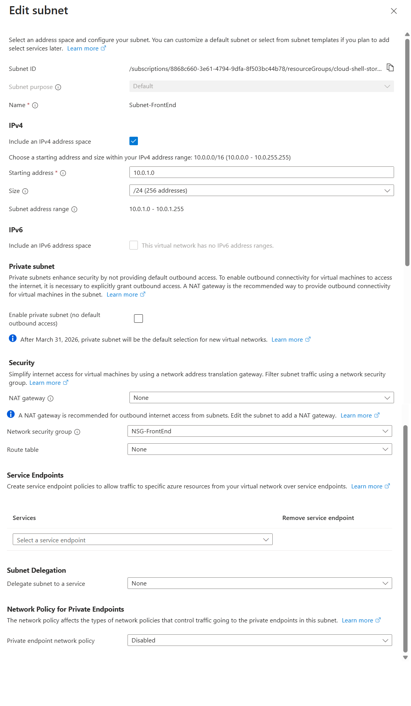
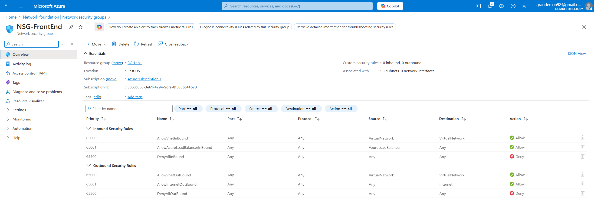

# 🧪 Lab 1 – Azure VNet + Subnet + NSG

## ✅ What I Built
- Created a **Virtual Network** (`10.0.0.0/16`)
- Added a **Subnet** (`10.0.1.0/24`)
- Created and attached a **Network Security Group (NSG)**
- Added a **Deny Inbound** rule (practice with priorities)

---

## 🧠 Concepts Learned
- Azure **Resource Group** structure
- **VNet & subnet design** (CIDR, /16 → /24)
- **NSG rule priority** (lower number = higher priority)
- Default **inbound/outbound** behavior in NSGs

---

## 🗺️ Topology (text)
Resource Group: RG-Lab1
└── VNET-Lab1 (10.0.0.0/16)
    └── Subnet-FrontEnd (10.0.1.0/24)
        └── NSG-FrontEnd (custom deny inbound rule)

---

## ✅ Verification Screenshots
**Subnet with NSG Attached**  

**NSG Inbound Rules**  

---

## 🔁 How to Rebuild (very short)
1. Create **RG-Lab1**
2. Create **VNET-Lab1** (`10.0.0.0/16`) → add subnet **Subnet-FrontEnd** (`10.0.1.0/24`)
3. Create **NSG-FrontEnd** → attach to **Subnet-FrontEnd**
4. Add inbound rule (Action: **Deny**, Priority `200`, Any/Any) for practice

---

## 🧹 Cleanup (optional)
Delete resource group **RG-Lab1** to remove all resources.
