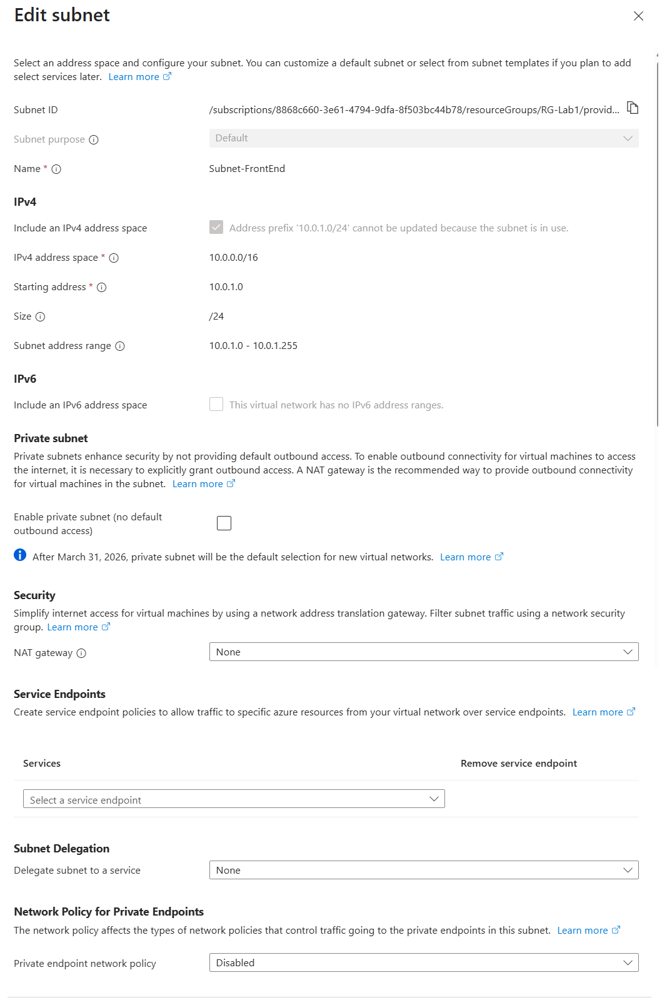
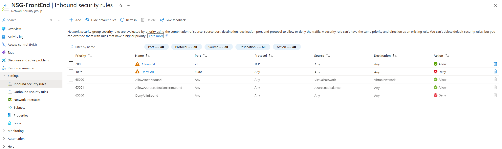
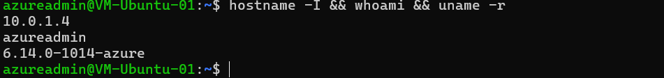

# 🧪 Lab 2 – Azure VNet + Subnet + NSG + VM

This lab builds on Lab 1 by deploying a Virtual Network, subnet, and Network Security Group, then deploying a Linux virtual machine into the subnet and validating NSG rules via SSH.

---

## ✅ What I Built

- Deployed a **Virtual Network**: `VNET-Hub-01 (10.0.0.0/16)`  
- Added a **Subnet**: `Subnet-FrontEnd (10.0.1.0/24)`  
- Created and attached a **Network Security Group (NSG)**: `NSG-FrontEnd`
- Added inbound rules:
  - **Allow-SSH** (Priority **200**, TCP **22**, Any → Any, **Allow**)
  - **Deny-All** (Priority **4096**, Any → Any, **Deny**)
- Deployed a **Linux VM**: `VM-Ubuntu-01` (Ubuntu 24.04 LTS, `Standard_B1s`, East US 2)
- Connected using SSH with a key pair and verified access

---

## 🧠 Concepts Learned

- NSG **inbound** vs **outbound** evaluation and priorities
- Why NSGs are often attached at the **subnet** level for consistent policy
- **SSH key** authentication flow (private key on client, public key on VM)
- VM **public IP** and NIC relationships
- Basic VM hardening (deny-all baseline with explicit allow for SSH)

---

## 🌐 Topology (Text)

Resource Group: RG-Lab1
└── VNET-Hub-01 (10.0.0.0/16)
└── Subnet-FrontEnd (10.0.1.0/24) ── attached ──> NSG-FrontEnd
└── VM-Ubuntu-01 (Ubuntu 24.04 LTS, B1s, SSH allowed)


---

## 📸 Verification Screenshots

**Subnet with NSG attached**  


**NSG Inbound Rules**  


**SSH Session**  


---

## 🧪 Commands Used

```bash
# SSH from Windows PowerShell (example)
ssh -i "C:\Users\<YOUR USERNAME>\Desktop\AZLabs\VM-Ubuntu-01_key.pem" azureadmin@<PUBLIC_IP>

# On the VM (basic health/update)
sudo apt update && sudo apt upgrade -y
uname -r
hostname -I
whoami
